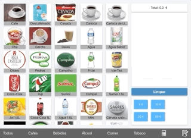

### CAFE CASH REGISTER ###

The cash register app!

It was built and used in a small cafe business.

* Main screen

* Backend screen

### Tech ###

Was built using Swift and CoreData to store the products information and images localy in the device.

The products are first loaded via the backend where the user can suply a .json url location with all the products data and image urls.

### How to use ###

For the app to work: 

* You have to go to the backend and configure the url that has the json file with the products and the urls to get the images

1 - Go to Backend (click in the bottom right button in the main screen) 

* Click "Configurar localização dos dados"
* In the field dados add the .json location url and click "Salvar"
* Click in "obter dados online" to get the products data
* Return to the main screen and the products should be loaded

### .json products file format ###
You just have to add the types and then the items like below:

{
  "types": [
    "Cafe",
    "Bebidas",
    "Alcool",
    "Comer",
    "Tabaco"
  ],
  "items": [
    {
      "name": "Capuccino",
      "price": 2.55,
      "type": "Cafe",
      "url": "https://image_url"
    }
  ]
}

